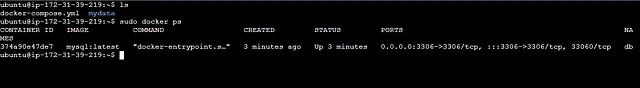
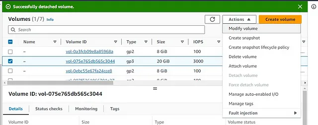

# Data persistence between two different MySQL databases hosted on two seperate EC2 instances using Elastic Block Storage(EBS)


## Introduction:
In this hands on demo i will show you how data will persistence between two different MySQL databases hosted on two seperate EC2 instances using Elastic Block Storage(EBS).

## What is EC2?
Amazon Elastic Compute Cloud (Amazon EC2) is a web service offered by Amazon Web Services (AWS) that provides resizable compute capacity in the cloud. It allows users to run virtual machines, known as instances, on Amazon's cloud infrastructure. EC2 instances can be used for a wide range of computing tasks, from hosting websites and web applications to running complex data analysis and machine learning workloads.

## What is EBS?
Amazon Elastic Block Store (Amazon EBS) is a block storage service provided by Amazon Web Services (AWS) that allows users to create and manage block-level storage volumes for use with Amazon EC2 (Elastic Compute Cloud) instances. EBS volumes are used to provide scalable and persistent storage for your EC2 instances and are an integral part of building and running applications in the AWS cloud.

## Overview of the full diagram below:


## Prerequisite:
You will need AWS account
Knowledge about VM instance, Subnetting, Network interface, SQL commands, MySQL databases.

## Step 1:
In this step we will create two vm and install docker container in them, then we will install mysql in docker container. We will attach an EBS volume with one instance.
First log into AWS dashboard.


Now click on EC2.


From left hand menu click on instances.


Give name to the instance(old-ja-1).


select ubuntu as operating system.


select instance type, key-pair(proceed without key-pair).


Now add new 20 GB EBS volume. This volume is detachable.


Now click on launch instance button and wait.


Successfully we have created our first instances.


Again launch an instance. Give name(new-ja-1).


select ubuntu.


select instance type and key-pair


click on launch instance.


see the table, we have our two vm(old-ja-1 and new-ja-1).


## Step 2:
Now in this step we will launch vm terminal and will install docker container and mysql in the vm.

## For vm-1(old-ja-1):
check the old-ja-1 and click on connect


Now are in connect to instance page.


Now, click on connect button.


we have successfully launched our old-ja-1 terminal


Now, type this commands one by one to update and install docker

```ruby
sudo apt update -y
```

```ruby
# Add Docker's official GPG key:
sudo apt-get update
sudo apt-get install ca-certificates curl gnupg
sudo install -m 0755 -d /etc/apt/keyrings
curl -fsSL https://download.docker.com/linux/ubuntu/gpg | sudo gpg --dearmor -o /etc/apt/keyrings/docker.gpg
sudo chmod a+r /etc/apt/keyrings/docker.gpg

# Add the repository to Apt sources:
echo \
  "deb [arch="$(dpkg --print-architecture)" signed-by=/etc/apt/keyrings/docker.gpg] https://download.docker.com/linux/ubuntu \
  "$(. /etc/os-release && echo "$VERSION_CODENAME")" stable" | \
  sudo tee /etc/apt/sources.list.d/docker.list > /dev/null
sudo apt-get update
```

```ruby
sudo apt-get install docker-ce docker-ce-cli containerd.io docker-buildx-plugin docker-compose-plugin
```

now, check if docker is installed or not

```ruby
sudo docker run hello-world
```


now type lsblk, to see the list of storage.


xvdb is 20GB volume that we have created. we need to mount it with a directory of the host. So now we have to make a directory, type this command.

```ruby
mkdir mydata
```


Before mounting the volume with the directory we have to make the volume with a filesystem. So, type this command.

```ruby
sudo mkfs -t xfs /dev/xvdb
```

 

check if the volume is turned into a file system or not.

```ruby
sudo file -s /dev/xvdb
```


Now, type this command to mount the volume with mydata directory

```ruby
sudo mount /dev/xvdb /home/ubuntu/mydata
```


now we will create a docker compose file to install mysql. Type this command

```ruby
sudo vim docker-compose.yml
```


Now copy and paste this code

```ruby
version: "3"

services:
  mysql:
    image: mysql:latest
    container_name: db
    environment:
      MYSQL_ROOT_PASSWORD: a
      MYSQL_DATABASE: db
      MYSQL_USER: a
      MYSQL_PASSWORD: a
    volumes:
      - ./mydata:/var/lib/mysql
    ports:
      - "3306:3306"
    restart: always
```

Save and quit. We have create a databse(db), given password(a) and user name is root. Now type this code to run the container

```ruby
sudo docker compose up
````

Wait for sometime, you will see the mysql container is running.


We have to let this terminal open as it is. So, we need another old-ja-a terminal to work. Open another old-ja-1 terminal and type this command to check if mysql container is running or not.

```ruby
sudo docker ps
```



now type this command to enter in container

```ruby
sudo docker exec -it db bash
```


now type this command to enter into database

```ruby
mysql -u root -p
```

username is root and enter password(a)


type this command to show databases.

```ruby
show databases;
```


Now, type this command to use db.

```ruby
use db;
```


type this command to show tables.

```ruby
show tables;
```

there is no table in database. We will create a table(my_table).Copy and paste thios sql command.

```ruby
CREATE TABLE my_table (
    id INT AUTO_INCREMENT PRIMARY KEY,
    name VARCHAR(255) NOT NULL,
    age INT
);
```


insert some data.

```ruby
INSERT INTO my_table (name, age)
VALUES
    ('John Doe', 30),
    ('Jane Smith', 25),
    ('Bob Johnson', 45),
    ('Alice Williams', 28),
    ('Eva Davis', 35);
```


Now type this command to show all data

```ruby
select * from my_table;
```


This data is saved in the mydata directory as well as in the EBS volume.

## For vm-2(new-ja-1):
We have to type same commands in this vm like old-ja-1. Type this commands one by one.

```ruby
sudo apt update -y
```

```ruby
# Add Docker's official GPG key:
sudo apt-get update
sudo apt-get install ca-certificates curl gnupg
sudo install -m 0755 -d /etc/apt/keyrings
curl -fsSL https://download.docker.com/linux/ubuntu/gpg | sudo gpg --dearmor -o /etc/apt/keyrings/docker.gpg
sudo chmod a+r /etc/apt/keyrings/docker.gpg

# Add the repository to Apt sources:
echo \
  "deb [arch="$(dpkg --print-architecture)" signed-by=/etc/apt/keyrings/docker.gpg] https://download.docker.com/linux/ubuntu \
  "$(. /etc/os-release && echo "$VERSION_CODENAME")" stable" | \
  sudo tee /etc/apt/sources.list.d/docker.list > /dev/null
sudo apt-get update
```

```ruby
sudo apt-get install docker-ce docker-ce-cli containerd.io docker-buildx-plugin docker-compose-plugin
```

```ruby
sudo docker run hello-world
```
```ruby
mkdir another_folder
```
```ruby
sudo mkfs -t xfs /dev/xvdf
```
```
sudo file -s /dev/xvdf
```

```ruby
sudo mount /dev/xvdf /home/ubuntu/mydata
```

```ruby
sudo vim docker-compose.yml
```

```ruby
version: "3"

services:
  mysql:
    image: mysql:latest
    container_name: db
    environment:
      MYSQL_ROOT_PASSWORD: a
      MYSQL_DATABASE: db
      MYSQL_USER: a
      MYSQL_PASSWORD: a
    volumes:
      - ./another_folder:/var/lib/mysql
    ports:
      - "3306:3306"
    restart: always
```

```ruby
sudo docker compose up
```

## Step 2:
In this step we will detache the EBS volume from old-ja-1 vm to check if this data is persistence or not. We will attach this EBS volume with our new-ja-1 vm.
Go to EC2 dashboard, from left hand menu click on volumes.


select 20GB volume and from Action tab select Detach volume.


successfully detached volume.



Now again from Action tab select Attach volume.
Select new-ja-1 vm and click attach volume.


## Testing the persistency of data:
Open a terminal of new-ja-1 and type this command to run mysql docker container

```ruby
sudo docker compose up
```


Now open another new-ja-1 vm terminal.
Type this command

```ruby
sudo docker exec -it db bash
```

```ruby
mysql -u root -p
```

```ruby
show databases;
```
```ruby
use db;
```

```ruby
show tables;
```

```ruby
select * from my_table;
```


See? we haven't insert any new data or tables in the database from new-ja-1, but shows the all old data. So, it proves the persistence of data.
